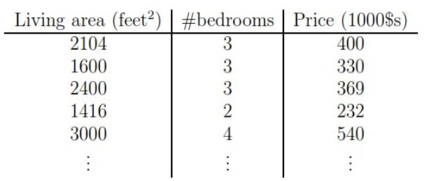
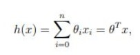
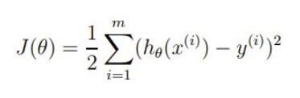
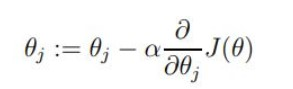
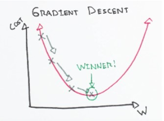
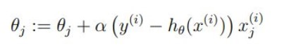

# Introduction

A linear regression is a statistical model that analyzes the relationship between a response variable (often called y) and one or more variables and their interactions (often called x or explanatory variables). You make this kind of relationships in your head all the time, for example when you calculate the age of a child based on her height, you are assuming the older she is, the taller she will be. Linear regression is one of the most basic statistical models out there, its results can be interpreted by almost everyone, and it has been around since the 19th century. This is precisely what makes linear regression so popular. It’s simple, and it has survived for hundreds of years. Even though it is not as sophisticated as other algorithms like artificial neural networks or random forests, according to a survey made by KD Nuggets, regression was the algorithm most used by data scientists in 2016 and 2017.

Regression belongs to the class of Supervised Learning tasks where the datasets that are used for predictive/statistical modeling contain continuous labels. 

## How does it works?

Linear regression is perhaps one of the most well known and well-understood algorithms in statistics and machine learning. Linear regression was developed in the field of statistics and is studied as a model for understanding the relationship between input and output numerical variables, but with the course of time, it has become an integral part of modern machine learning toolbox.

Let's have a toy dataset for it. You will use the same house price prediction dataset to investigate this but this time with two features. The task remains the same i.e., predicting the house price.



As mentioned earlier, now the x’s are two-dimensional which means your dataset contains two features. For instance, x1(i) is the living area of the i-th house in the training set, and x2(i) is its number of bedrooms.

To perform regression, you must decide the way you are going to represent h. As an initial choice, let’s say you decide to approximate y as a linear function of x:

                                        hθ(x) = θ0 + θ1x1 + θ2x2


Here, the θi’s are the parameters (also called weights) parameterizing the space of linear functions mapping from X to Y. In a simpler sense, these parameters are used for accurately mapping X to Y. But to keep things simple for your understanding, you will drop the θ subscript in hθ(x), and write it simply as h(x). To simplify your notation even further, you will also introduce the convention of letting x0 = 1 (this is the intercept term), so that




where on the right-hand side above you are considering θ and x both as vectors, and here n is the number of input instances (not counting x0).

But the main question that gets raised at this point is how do you pick or learn the parameters θ? You cannot change your input instances as to predict the prices. You have only these θ parameters to tune/adjust.

One prominent method seems to be to make h(x) close to y, at least for the training examples you have. To understand this more formally, let's try defining a function that determines, for each value of the θ’s, how close the h(x(i))’s are to the corresponding y(i) ’s. The function should look like the following:




To understand the reason behind taking the squared value instead of the absolute value, consider this squared-term as an advantage for the future operations to be performed for training the regression model.

You just saw one of the most important formulas in the world of Data Science/Machine Learning/Statistics. It is called as **cost function.**

This is an essential derivation because not only it gives birth to the next evolution of the linear regression (Ordinary Least Squares) but also formulates the foundations of a whole class of linear modeling algorithms (remember you came across a term called Generalized Linear Models).

It is important to note that, linear regression can often be divided into two basic forms:

- Simple Linear Regression (SLR) which deals with just two variables (the one you saw at first)


- Multi-linear Regression (MLR) which deals with more than two variables (the one you just saw)


These things are very straightforward but can often cause confusion.

You have already laid your foundations of linear regression. Now you will study more about the ways of estimating the parameters you saw in the above section. This estimation of parameters is essentially known as the training of linear regression. Now, there are many methods to train a linear regression model and [**Ordinary Least Squares (OLS)**](https://www.xlstat.com/en/solutions/features/ordinary-least-squares-regression-ols) being the most popular among them. So, it is good to refer a linear regression model trained using OLS as Ordinary Least Squares Linear Regression or just Least Squares Regression.

## Optimizing a linear regression model 

Learning/training a linear regression model essentially means estimating the values of the coefficients/parameters used in the representation with the data you have.

In this section, you will take a brief look at some techniques to prepare a linear regression model.

### Least squares' regression:

You left the previous section with a notion to choose θ so as to minimize J(θ). To do so, let’s use a search algorithm that starts with some "initial guess" for θ, and that iteratively changes θ to make J(θ) smaller, until hopefully, you converge to a value of θ that minimizes J(θ). Specifically, let’s consider the gradient descent algorithm, which starts with some initial θ, and repeatedly performs the update:



(This update is simultaneously performed for all values of j = 0, . . . , n.) Here, α is called the [**learning rate**](https://developers.google.com/machine-learning/crash-course/reducing-loss/learning-rate).  This is a very natural algorithm that repeatedly takes a step in the direction of steepest decrease of J. This term α effectively controls how steep your algorithm would move to the decrease of J. It can be pictorially expressed as the following:



Intuitively speaking, the above formula denotes the small change that happens in J w.r.t the θj parameter and how it affects the initial value of θj. But look carefully, you have a partial derivative here to deal with. The whole derivation process is out of the scope of this tutorial.

Just note that for a single training example, this gives the update rule:



The rule is called the LMS update rule (LMS stands for “least mean squares”) and is also known as the [Widrow-Hoff learning rule](http://vision.psych.umn.edu/users/kersten/kersten-lab/courses/Psy5038WF2014/Lectures/Lect_10_RegressWid/Lect_10_RegressWid.nb.pdf).

### Gradient descent

In the previous training rule, you already got the notion of how gradient descent can be incorporated in this context. Essentially, gradient descent is a process of optimizing the values of the coefficients by iteratively minimizing the error of the model on your training data.

More briefly speaking, it works by starting with random values for each coefficient. The sum of the squared errors is calculated for each pair of input and output values. A learning rate is used as a scale factor, and the coefficients are updated in the direction towards minimizing the error. The process is repeated until a minimum sum squared error is achieved or no further improvement is possible.

The term α (learning rate) is very important here since it determines the size of the improvement step to take on each iteration of the procedure.

Now there are commonly two variants of gradient descent:

- The method that looks at every example in the entire training set on every step and is called **batch gradient descent**.


- The method where you repeatedly run through the training set, and each time you encounter a training example, you update the parameters according to the gradient of the error with respect to that single training example only. This algorithm is called **stochastic gradient descent** (also incremental gradient descent).


### Regularization 

Regularization methods work by penalizing the coefficients of features having extremely large values and thereby try to reduce the error. It not only results in an enhanced error rate but also, it reduces the model complexity. This is particularly very useful when you are dealing with a dataset that has a large number of features, and your baseline model is not able to distinguish between the importance of the features (not all features in a dataset are equally important, right?).

There are two variants of regularization procedures for linear regression are:

- [Lasso Regression](https://www.statisticshowto.com/lasso-regression/): adds a penalty term which is equivalent to the absolute value of the magnitude of the coefficients (also called L1 regularization). 


- [Ridge Regression](https://www.statisticshowto.com/ridge-regression/): adds a penalty term which is equivalent to the square of the magnitude of coefficients (also called L2 regularization).

### Is it still worth the time to learn linear regression?

Is it not? You already saw how gracefully linear regression introduces some of the most critical concepts of Machine Learning such as cost functions, optimization, variable relationships and what not? All these things are vital even if you are constructing a neural network. The applicability may differ in some places, but the overall concepts remain precisely the same. So, without understanding these fundamental things, you will never be able to reason why your neural net is not performing well.

Moreover, a simple concept of deriving the relationships among variables gave birth to so many concepts and most importantly it created a whole new family of algorithms - Generalized Linear Models. So for aspiring Data Science/Machine Learning/Artificial Intelligence practitioner, this algorithm is something which cannot be neglected. You already have understood that by now!

### Model Building in Scikit-learn


```python
import statsmodels.api as sm
from sklearn import datasets

data = datasets.load_boston()
```


```python
print (data.DESCR)
```

Now, before applying linear regression, you will have to prepare the data and segregate the features and the label of the dataset. MEDV (median home value) is the label in this case. You can access the features of the dataset using feature_names attribute.


```python
# Pandas and NumPy import
import numpy as np
import pandas as pd

# Set the features  
df = pd.DataFrame(data.data, columns=data.feature_names)

# Set the target
target = pd.DataFrame(data.target, columns=["MEDV"])
```

At this point, you need to consider a few important things about linear regression before applying it to the data. You could have studied this earlier in this tutorial, but studying these factors at this particular point of time will help you get the real feel.

- **Linear Assumption:** Linear regression is best employed to capture the relationship between the input variables and the outputs. In order to do so, linear regression assumes this relationship to be linear (which might not be the case all the time). But you can always transform your data so that a linear relationship is maintained. For example, if your data has an exponential relationship, you can apply [log-transform](http://onlinestatbook.com/2/transformations/log.html) to make the relationship linear.


- **Collinearity between the features:** Collinearity is a measure to calculate the importance of a feature of a dataset mathematically. When you have a dataset in which the features are very correlated to each other, linear regression fails to approximate the relationship appropriately and tends to overfit. So, it is efficient to detect the highly correlated features and to drop them before you apply linear regression. 


Let's do some hands-on now. To keep things simple you will just take RM — the average number of rooms feature for now. Note that Statsmodels does not add a constant term (recall the factor θ0) by default. Let’s see it first without the constant term in your regression model:


```python
X = df["RM"]
y = target["MEDV"]

# Fit and make the predictions by the model
model = sm.OLS(y, X).fit()
predictions = model.predict(X)

# Print out the statistics
model.summary()
```


<table class="simpletable">
<caption>OLS Regression Results</caption>
<tr>
  <th>Dep. Variable:</th>          <td>MEDV</td>       <th>  R-squared (uncentered):</th>      <td>   0.901</td> 
</tr>
<tr>
  <th>Model:</th>                   <td>OLS</td>       <th>  Adj. R-squared (uncentered):</th> <td>   0.901</td> 
</tr>
<tr>
  <th>Method:</th>             <td>Least Squares</td>  <th>  F-statistic:       </th>          <td>   4615.</td> 
</tr>
<tr>
  <th>Date:</th>             <td>Tue, 04 Aug 2020</td> <th>  Prob (F-statistic):</th>          <td>3.74e-256</td>
</tr>
<tr>
  <th>Time:</th>                 <td>11:17:03</td>     <th>  Log-Likelihood:    </th>          <td> -1747.1</td> 
</tr>
<tr>
  <th>No. Observations:</th>      <td>   506</td>      <th>  AIC:               </th>          <td>   3496.</td> 
</tr>
<tr>
  <th>Df Residuals:</th>          <td>   505</td>      <th>  BIC:               </th>          <td>   3500.</td> 
</tr>
<tr>
  <th>Df Model:</th>              <td>     1</td>      <th>                     </th>              <td> </td>    
</tr>
<tr>
  <th>Covariance Type:</th>      <td>nonrobust</td>    <th>                     </th>              <td> </td>    
</tr>
</table>
<table class="simpletable">
<tr>
   <td></td>     <th>coef</th>     <th>std err</th>      <th>t</th>      <th>P>|t|</th>  <th>[0.025</th>    <th>0.975]</th>  
</tr>
<tr>
  <th>RM</th> <td>    3.6534</td> <td>    0.054</td> <td>   67.930</td> <td> 0.000</td> <td>    3.548</td> <td>    3.759</td>
</tr>
</table>
<table class="simpletable">
<tr>
  <th>Omnibus:</th>       <td>83.295</td> <th>  Durbin-Watson:     </th> <td>   0.493</td>
</tr>
<tr>
  <th>Prob(Omnibus):</th> <td> 0.000</td> <th>  Jarque-Bera (JB):  </th> <td> 152.507</td>
</tr>
<tr>
  <th>Skew:</th>          <td> 0.955</td> <th>  Prob(JB):          </th> <td>7.65e-34</td>
</tr>
<tr>
  <th>Kurtosis:</th>      <td> 4.894</td> <th>  Cond. No.          </th> <td>    1.00</td>
</tr>
</table><br/><br/>Warnings:<br/>[1] Standard Errors assume that the covariance matrix of the errors is correctly specified.


```python

```


What is this output! It is way too big to understand when you are seeing it for the first time. Let's go through the most critical points step by step:

- The first observation you should make here is you are using OLS method to train your linear regression model.


- There's a value corresponding to R-Squared. R-squared is the “percent of variance explained” by the model. That is, R-squared is the fraction by which the variance of the errors is less than the variance of the dependent variable. R-squared values range from 0 to 1 and are commonly stated as percentages from 0% to 100%. R-squared will give you an estimate of the relationship between movements of a dependent variable based on an independent variable's movements. It doesn't tell you whether your chosen model is good or bad, nor will it tell you whether the data and predictions are biased. A high or low R-square isn't necessarily good or bad, as it doesn't convey the reliability of the model, nor whether you've chosen the right regression. You can get a low R-squared for a good model, or a high R-square for a poorly fitted model, and vice versa.


- The coefficient (coef) of 3.634 means that if the RM variable increases by 1, the predicted value of MEDV increases by 3.634.


- There is a 95% confidence intervals for the RM which means that the model predicts at a 95% percent confidence that the value of RM is between 3.548 to 3.759).


These are the most important points you should take care of for the time being (and you can ignore the warning as well).

A constant term can easily be added to the linear regression model. You can do it by X = sm.add_constant(X) (X is the name of the dataframe containing the input (independent variables).


```python
X = sm.add_constant(X)

model = sm.OLS(y, X).fit()
predictions = model.predict(X)

model.summary()
```

    C:\Users\chrys\Anaconda3\lib\site-packages\numpy\core\fromnumeric.py:2495: FutureWarning: Method .ptp is deprecated and will be removed in a future version. Use numpy.ptp instead.
      return ptp(axis=axis, out=out, **kwargs)
    


<table class="simpletable">
<caption>OLS Regression Results</caption>
<tr>
  <th>Dep. Variable:</th>          <td>MEDV</td>       <th>  R-squared:         </th> <td>   0.484</td>
</tr>
<tr>
  <th>Model:</th>                   <td>OLS</td>       <th>  Adj. R-squared:    </th> <td>   0.483</td>
</tr>
<tr>
  <th>Method:</th>             <td>Least Squares</td>  <th>  F-statistic:       </th> <td>   471.8</td>
</tr>
<tr>
  <th>Date:</th>             <td>Tue, 04 Aug 2020</td> <th>  Prob (F-statistic):</th> <td>2.49e-74</td>
</tr>
<tr>
  <th>Time:</th>                 <td>11:19:08</td>     <th>  Log-Likelihood:    </th> <td> -1673.1</td>
</tr>
<tr>
  <th>No. Observations:</th>      <td>   506</td>      <th>  AIC:               </th> <td>   3350.</td>
</tr>
<tr>
  <th>Df Residuals:</th>          <td>   504</td>      <th>  BIC:               </th> <td>   3359.</td>
</tr>
<tr>
  <th>Df Model:</th>              <td>     1</td>      <th>                     </th>     <td> </td>   
</tr>
<tr>
  <th>Covariance Type:</th>      <td>nonrobust</td>    <th>                     </th>     <td> </td>   
</tr>
</table>
<table class="simpletable">
<tr>
    <td></td>       <th>coef</th>     <th>std err</th>      <th>t</th>      <th>P>|t|</th>  <th>[0.025</th>    <th>0.975]</th>  
</tr>
<tr>
  <th>const</th> <td>  -34.6706</td> <td>    2.650</td> <td>  -13.084</td> <td> 0.000</td> <td>  -39.877</td> <td>  -29.465</td>
</tr>
<tr>
  <th>RM</th>    <td>    9.1021</td> <td>    0.419</td> <td>   21.722</td> <td> 0.000</td> <td>    8.279</td> <td>    9.925</td>
</tr>
</table>
<table class="simpletable">
<tr>
  <th>Omnibus:</th>       <td>102.585</td> <th>  Durbin-Watson:     </th> <td>   0.684</td> 
</tr>
<tr>
  <th>Prob(Omnibus):</th> <td> 0.000</td>  <th>  Jarque-Bera (JB):  </th> <td> 612.449</td> 
</tr>
<tr>
  <th>Skew:</th>          <td> 0.726</td>  <th>  Prob(JB):          </th> <td>1.02e-133</td>
</tr>
<tr>
  <th>Kurtosis:</th>      <td> 8.190</td>  <th>  Cond. No.          </th> <td>    58.4</td> 
</tr>
</table><br/><br/>Warnings:<br/>[1] Standard Errors assume that the covariance matrix of the errors is correctly specified.


```python

```

It can be clearly seen that the addition of the constant term has a direct effect on the coefficient term. Without the constant term, your model was passing through the origin, but now you have a y-intercept at -34.67. Now the slope of the RM predictor is also changed from 3.634 to 9.1021 (coef of RM).

Now you will fit a regression model with more than one variable — you will add LSTAT (percentage of lower status of the population) along with the RM variable. The model training (fitting) procedure remains the exact same as previous:


```python
X = df[["RM", "LSTAT"]]
y = target["MEDV"]

model = sm.OLS(y, X).fit()
predictions = model.predict(X)

model.summary()
```


<table class="simpletable">
<caption>OLS Regression Results</caption>
<tr>
  <th>Dep. Variable:</th>          <td>MEDV</td>       <th>  R-squared (uncentered):</th>      <td>   0.948</td>
</tr>
<tr>
  <th>Model:</th>                   <td>OLS</td>       <th>  Adj. R-squared (uncentered):</th> <td>   0.948</td>
</tr>
<tr>
  <th>Method:</th>             <td>Least Squares</td>  <th>  F-statistic:       </th>          <td>   4637.</td>
</tr>
<tr>
  <th>Date:</th>             <td>Tue, 04 Aug 2020</td> <th>  Prob (F-statistic):</th>           <td>  0.00</td> 
</tr>
<tr>
  <th>Time:</th>                 <td>11:19:34</td>     <th>  Log-Likelihood:    </th>          <td> -1582.9</td>
</tr>
<tr>
  <th>No. Observations:</th>      <td>   506</td>      <th>  AIC:               </th>          <td>   3170.</td>
</tr>
<tr>
  <th>Df Residuals:</th>          <td>   504</td>      <th>  BIC:               </th>          <td>   3178.</td>
</tr>
<tr>
  <th>Df Model:</th>              <td>     2</td>      <th>                     </th>              <td> </td>   
</tr>
<tr>
  <th>Covariance Type:</th>      <td>nonrobust</td>    <th>                     </th>              <td> </td>   
</tr>
</table>
<table class="simpletable">
<tr>
    <td></td>       <th>coef</th>     <th>std err</th>      <th>t</th>      <th>P>|t|</th>  <th>[0.025</th>    <th>0.975]</th>  
</tr>
<tr>
  <th>RM</th>    <td>    4.9069</td> <td>    0.070</td> <td>   69.906</td> <td> 0.000</td> <td>    4.769</td> <td>    5.045</td>
</tr>
<tr>
  <th>LSTAT</th> <td>   -0.6557</td> <td>    0.031</td> <td>  -21.458</td> <td> 0.000</td> <td>   -0.716</td> <td>   -0.596</td>
</tr>
</table>
<table class="simpletable">
<tr>
  <th>Omnibus:</th>       <td>145.153</td> <th>  Durbin-Watson:     </th> <td>   0.834</td>
</tr>
<tr>
  <th>Prob(Omnibus):</th> <td> 0.000</td>  <th>  Jarque-Bera (JB):  </th> <td> 442.157</td>
</tr>
<tr>
  <th>Skew:</th>          <td> 1.351</td>  <th>  Prob(JB):          </th> <td>9.70e-97</td>
</tr>
<tr>
  <th>Kurtosis:</th>      <td> 6.698</td>  <th>  Cond. No.          </th> <td>    4.72</td>
</tr>
</table><br/><br/>Warnings:<br/>[1] Standard Errors assume that the covariance matrix of the errors is correctly specified.


```python

```

Let's interpret this one now:

This model has a much higher R-squared value — 0.948, which essentially means that this model captures 94.8% of the variance in the dependent variable. Now, let's try to figure out the relationship between the two variables RM and LSTAT and median house value. As RM increases by 1, MEDV will increase by 4.9069, and when LSTAT increases by 1, MEDV will decrease by 0.6557. This indicates that RM and LSTAT are statistically significant in predicting (or estimating) the median house value.

You can interpret this relationship in plain English as well:

Houses having a small number of rooms are likely to have low price values.
In the areas where the status of the population, is lower the house prices are likely to be low.
Makes more sense now! Isn't it?

This was the example of both single and multiple linear regression in Statsmodels. Your homework will be to investigate and interpret the results with the further features.

Next, let's see how linear regression can be implemented using your very own scikit-learn. You already have the dataset imported, but you will have to import the linear_model class.


```python
from sklearn import linear_model
```


```python
X = df
y = target["MEDV"]

lm = linear_model.LinearRegression()
model = lm.fit(X,y)
```

The model training is completed. This sklearn implementation also uses OLS. Let's make some predictions of MEDV values for the first five samples.


```python
predictions = lm.predict(X)
print(predictions[0:5])
```

    [30.00384338 25.02556238 30.56759672 28.60703649 27.94352423]
    

If you want to know some more details (such as the R-squared, coefficients, etc.) of your model, you can easily do so.


```python
lm.score(X,y)
```


```python
lm.coef_
```

### Pros

- Linear Regression is simple to implement and easier to interpret the output coefficients.

- When you know the relationship between the independent and dependent variable have a linear relationship, this algorithm is the best to use because of it’s less complexity to compared to other algorithms.

- Linear Regression is susceptible to over-fitting but it can be avoided using some dimensionality reduction techniques, regularization (L1 and L2) techniques and cross-validation.


### Cons

- On the other hand in linear regression technique outliers can have huge effects on the regression and boundaries are linear in this technique.

- Diversely, linear regression assumes a linear relationship between dependent and independent variables. That means it assumes that there is a straight-line relationship between them. It assumes independence between attributes.

- But then linear regression also looks at a relationship between the mean of the dependent variables and the independent variables. Just as the mean is not a complete description of a single variable, linear regression is not a complete description of relationships among variables.

### Useful links:

- https://scikit-learn.org/stable/auto_examples/linear_model/plot_ols.html
- https://www.geeksforgeeks.org/linear-regression-python-implementation/
- https://www.quora.com/Why-do-we-use-square-error-instead-of-absolute-value-when-we-calculate-R-2-in-regression-analysis
- https://realpython.com/linear-regression-in-python/

