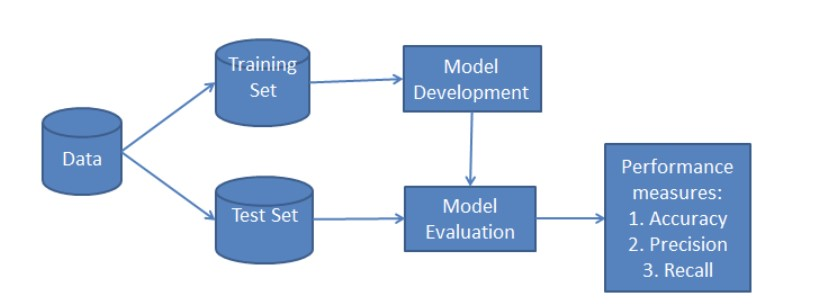

# Introduction to Classification

Classification is a large domain in the field of statistics and machine learning. Generally, classification can be broken down into two areas:

    1. Binary classification, where we wish to group an outcome into one of two groups.

    2. Multi-class classification, where we wish to group an outcome into one of multiple (more than two) groups.

In a machine learning context, classification is a type of supervised learning. Supervised learning means that the data fed to the network is already labeled, with the important features/attributes already separated into distinct categories beforehand.

This means that the network knows which parts of the input are important, and there is also a target or ground truth that the network can check itself against. An example of classification is sorting a bunch of different plants into different categories like ferns or angiosperms. That task could be accomplished with a Decision Tree, a type of classifier in Scikit-Learn.

The **process of training a model** is the process of feeding data into a neural network and letting it learn the patterns of the data. The training process takes in the data and pulls out the features of the dataset. During the training process for a supervised classification task the network is passed both the features and the labels of the training data. However, during testing, the network is only fed features.

The **testing process** is where the patterns that the network has learned are tested. The features are given to the network, and the network must predict the labels. The data for the network is divided into training and testing sets, two different sets of inputs. You do not test the classifier on the same dataset you train it on, as the model has already learned the patterns of this set of data and it would be extreme bias.

Instead, the dataset is **split up** into training and testing sets, a set the classifier trains on and a set the classifier has never seen before.

## Different Types of Classifiers

Scikit-Learn provides easy access to numerous different classification algorithms. Among these classifiers are:

- [K-Nearest Neighbors](00.KNN.md)
- [Logistic Regression](01.Logistic_Regression.md)
- [Decision Tree](02.Decision_Trees.md)
- [Support Vector Machines](03.SVM.md)
- [Naive Bayes](04.Naive_Bayes.md)

## Classification Workflow

Whenever you perform classification, the first step is to understand the problem and identify potential features and label. Features are those characteristics or attributes which affect the results of the label. For example, in the case of a loan distribution, bank manager's identify customer’s occupation, income, age, location, previous loan history, transaction history, and credit score. These characteristics are known as features which help the model classify customers.

The classification has two phases, a learning phase, and the evaluation phase. In the learning phase, classifier trains its model on a given dataset and in the evaluation phase, it tests the classifier performance. Performance is evaluated on the basis of various parameters such as accuracy, error, precision, and recall.

### Useful Links:

     - https://scikit-learn.org/stable/auto_examples/classification/plot_classifier_comparison.html
     - https://dzone.com/articles/introduction-to-classification-algorithms
